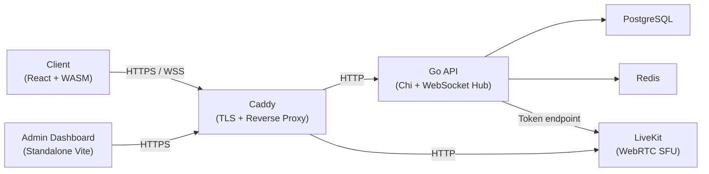
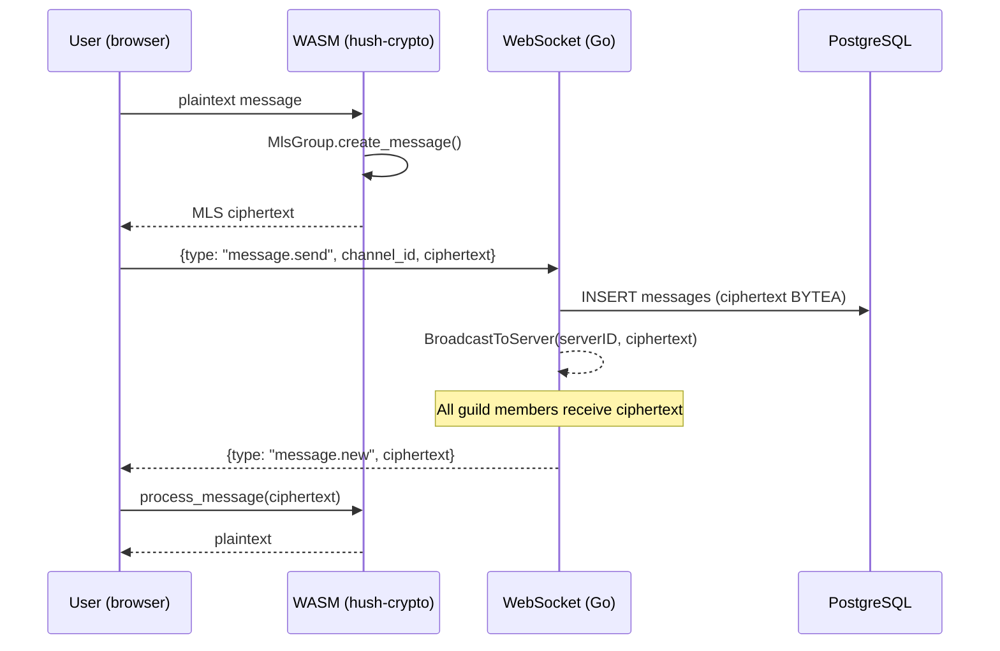

# Hush Architecture

This document describes Hush's system architecture as it exists at v1.0. It covers system overview, directory structure, data flow, authentication, encryption, multi-tenant model, backend opacity, key transparency, and infrastructure.

---

## 1. System Overview



**Summary:** The client is a React single-page app with OpenMLS compiled to WASM. All encryption happens in the browser. The Go backend routes ciphertext between clients and stores blobs it cannot read. Caddy handles TLS termination and proxying. LiveKit is the WebRTC SFU for voice/video — it forwards encrypted frames. PostgreSQL stores ciphertext and public key material. Redis provides session caching and rate limiting.

---

## 2. Directory Structure

```
hush-app/
├── server/                      # Go backend
│   ├── cmd/hush/main.go         # Entry point, Chi router, graceful shutdown
│   └── internal/
│       ├── api/                 # HTTP handlers (auth, guilds, channels, MLS, admin)
│       ├── auth/                # JWT sign/verify, Ed25519 challenge-response
│       ├── config/              # Environment-based configuration
│       ├── db/                  # PostgreSQL queries (store interface for DI)
│       ├── livekit/             # LiveKit access token generation
│       ├── models/              # Shared data types
│       └── ws/                  # WebSocket hub, client relay, message routing
├── migrations/                  # Sequential SQL migration files (golang-migrate)
│
├── client/                      # React frontend (Vite)
│   └── src/
│       ├── App.jsx              # Router (guild/channel layout)
│       ├── hooks/               # useAuth, useMLS, useRoom, useKeyPackageMaintenance
│       ├── lib/                 # API client, BIP39 identity, MLS group ops, vault, WebSocket client
│       ├── pages/               # TextChannel, VoiceChannel, ServerLayout, Home
│       └── components/          # Chat, ChannelList, MemberList, ServerList, Controls
│
├── client/admin/                # Standalone admin dashboard (no WASM, API key auth)
│   └── src/
│       ├── lib/adminApi.js      # Admin API client (X-Admin-Key header)
│       └── pages/               # GuildListPage, UserListPage, HealthPage, ConfigPage
│
├── hush-crypto/                 # Rust crate: OpenMLS 0.8.1 → WASM
│   └── src/
│       ├── credential.rs        # Ed25519 BasicCredential generation
│       ├── key_package.rs       # MLS KeyPackage builder
│       ├── group.rs             # Group ops: create, add/remove, commit, export_secret
│       └── wasm.rs              # wasm-bindgen JS bindings
│
├── scripts/
│   ├── setup.sh                 # First-run self-hoster script (secrets, TLS, health check)
│   └── update.sh                # Upgrade script (pg_dump backup, image pull, restart)
│
├── caddy/
│   ├── Caddyfile                # Dev/local reverse proxy config
│   └── Caddyfile.self-hoster.tmpl  # Production template with __DOMAIN__/__EMAIL__ placeholders
│
└── livekit/
    └── livekit.yaml             # LiveKit server config (API key/secret, port config)
```

---

## 3. Data Flow

### Message send



### Voice frame encryption

When a user joins a voice channel:

1. The client creates or joins a voice-type MLS group for that channel.
2. Frame key derived: `mlsGroup.export_secret("hush-voice-frame-key", epoch)`.
3. Key is applied to LiveKit's `ExternalE2EEKeyProvider`.
4. LiveKit E2EE worker encrypts outgoing frames and decrypts incoming frames using AES-256-GCM.
5. The LiveKit SFU forwards encrypted frames — it never has the frame key.
6. When membership changes (join/leave), MLS epoch advances, new key derived automatically.

---

## 4. Authentication

### BIP39 identity derivation

```
12-word mnemonic (BIP39)
        ↓ deterministic derivation
Ed25519 root keypair (private key stays on device)
        ↓
MLS BasicCredential (public key + identity)
        ↓ uploaded once on registration
Go backend stores: root public key + credential
```

### Session auth (challenge-response)

1. `POST /api/auth/challenge` — server generates random nonce (stored with short TTL)
2. Client signs nonce with Ed25519 root private key
3. `POST /api/auth/authenticate` — server verifies signature, issues JWT session token
4. All subsequent requests use JWT in `Authorization: Bearer` header

No passwords. No email. The server authenticates by verifying cryptographic ownership of a public key.

### Multi-device

Each device has an independent Ed25519 device keypair. Authorization flow:

1. New device generates its keypair, displays a QR code containing its public key.
2. Existing authenticated device scans the QR code, produces: `certificate = Sign(IK_existing_priv, IK_new_pub)`.
3. Certificate is uploaded to the server, which verifies the signature against the existing device's known public key.
4. New device is now trusted for authentication.

Private keys never leave the device that generated them.

### Guest access

Guests get an ephemeral keypair (no mnemonic). A short-lived JWT is issued directly without challenge-response. MLS state is lost when the guest session ends.

---

## 5. Encryption Architecture

### Chat (MLS, RFC 9420)

Each text channel is an independent MLS group. Ciphersuite: `MLS_128_DHKEMX25519_AES128GCM_SHA256_Ed25519`.

| Operation | MLS Call | Result |
|-|-|-|
| Create channel | `MlsGroup::new()` | New epoch, fresh key material |
| Add member | Propose `Add`, commit | New epoch, Welcome message sent to new member |
| Remove member | Propose `Remove`, commit | New epoch, removed member locked out |
| Send message | `MlsGroup::create_message(plaintext)` | MLS Application Message ciphertext |
| Receive message | `process_message(ciphertext)` | Plaintext, epoch validated |
| Key rotation | Propose `Update`, commit | New epoch, fresh leaf node |

Forward secrecy: each epoch has unique key material derived via TreeKEM. Prior epoch keys are deleted after epoch advancement. Post-compromise security: a single `Update + Commit` by a compromised member restores forward secrecy for subsequent epochs.

**Implementation:** `hush-crypto/` Rust crate (OpenMLS 0.8.1) compiled to WASM via wasm-pack. The WASM binary is bundled with the client. `client/src/lib/hushCrypto.js` is the WASM wrapper. `client/src/hooks/useMLS.js` manages group lifecycle.

### Voice frame keys (MLS-derived AES-256-GCM)

Frame keys are derived from the voice channel's MLS group, not generated randomly:

```
Voice MLS group epoch N
    ↓ export_secret("hush-voice-frame-key", epoch)
AES-256-GCM frame key
    ↓ applied to LiveKit ExternalE2EEKeyProvider
LiveKit E2EE worker encrypts/decrypts frames
```

No leader election. Every participant derives the same key from their local MLS group state. Key rotates automatically on every epoch change (membership event).

### Guild/channel metadata (AES-256-GCM, MLS-derived key)

Guild names and channel names are encrypted client-side before transmission:

```
Guild metadata MLS group
    ↓ export_secret("hush-guild-metadata")
AES-256-GCM metadata key
    ↓ encrypt(guild_name)
Server stores: encrypted_metadata BYTEA
```

The server stores only opaque blobs. It knows a guild exists (by UUID) but cannot read its name.

---

## 6. Multi-Tenant Model

One Hush instance hosts multiple guilds (servers). Each guild is isolated by server ID.

**Database tables:**
- `servers` — guild records: `id`, `encrypted_metadata` (BYTEA), `access_policy`, `discoverable`
- `server_members` — membership: `server_id`, `user_id`, `permission_level` (integer 0–3)
- `channels` — channel records: `id`, `server_id`, `type` (text/voice/category), `encrypted_metadata` (BYTEA)

**Permission levels (opaque integers):**

| Integer | Role |
|-|-|
| 0 | Member |
| 1 | Moderator |
| 2 | Admin |
| 3 | Owner |

Human-readable role labels exist only in encrypted guild metadata. The server sees only integers.

**WebSocket hub:** `hub.BroadcastToServer(serverID, msg)` fans out events to all members of a specific guild. Subscription is per-server-ID, enforced by membership check at WebSocket upgrade.

**Instance configuration:** `registration_mode` (open/invite-only) and `server_creation_policy` are stored in the `instance_config` table. Configured via the admin dashboard.

---

## 7. Backend Opacity

The server is a blind relay. It cannot read message content, guild names, channel names, or role labels.

| What the server stores | Format |
|-|-|
| Chat messages | MLS ciphertext (BYTEA) |
| Guild/channel metadata | AES-256-GCM ciphertext (BYTEA) |
| MLS KeyPackages | Public key material |
| MLS Commits, Welcome messages | MLS protocol messages |
| User root public key | Ed25519 public key |
| Permission levels | Integer 0–3 |
| Timestamps, UUIDs | Plaintext (routing metadata) |

| What the server never stores | Reason |
|-|-|
| Plaintext message content | Encrypted by MLS before transmission |
| Guild names | Encrypted by AES-256-GCM before transmission |
| Channel names | Encrypted by AES-256-GCM before transmission |
| Role labels | Exist only in encrypted metadata |
| Private keys | Never transmitted |
| Voice frame keys | Derived client-side from MLS, never sent |
| Media content (audio/video) | Encrypted frames forwarded by LiveKit SFU |

**Admin dashboard isolation:** The admin dashboard (`client/admin/`) uses API key authentication (`X-Admin-Key` header). It is not a Hush user account. It has access only to aggregated, opaque data: UUIDs, member counts, message counts, timestamps. There is no admin view of guild names, channel names, or message content.

---

## 8. Key Transparency

Hush implements T.1 key transparency: a signed Merkle log of key operations scoped to each instance.

**Logged events:**
- User registration (public key recorded)
- Device key added (device certificate recorded)
- Device key revoked
- MLS KeyPackage rotation

**Verification:** Clients call `GET /api/transparency/verify` at login and on key changes. The server returns an inclusion proof (Merkle path). The client verifies the proof against the locally cached root hash.

**Signing:** Each leaf is signed with an Ed25519 key whose seed is `TRANSPARENCY_LOG_PRIVATE_KEY` in `.env`. This seed is generated once by `setup.sh` and must never change — rotating it invalidates all existing proofs.

**T.2 limitation:** The log is instance-scoped. Cross-instance split-view resistance (T.2) requires a gossip protocol or global auditor and is not yet implemented.

---

## 9. Multi-Instance Client

The Hush web client can connect to multiple Hush instances simultaneously.

- Each instance has its own WebSocket connection with independent JWT authentication.
- Guilds from all instances appear in a unified sidebar, aggregated by instance color.
- The instance registry (URLs, auth tokens) is stored in browser storage.
- Identity is per-instance: the same mnemonic can derive credentials for multiple instances independently.

This is the architecture for a federated model where users self-host or use different providers.

---

## 10. Multi-Instance Authentication

Hush supports simultaneous connections to N independent instances from a single
browser session. All instances share the same BIP39 identity (Ed25519 keypair)
but each instance maintains its own user record and JWT.

### Identity Model

| Scope | Storage | What it holds |
|-|-|-|
| Identity (global) | IndexedDB vault, encrypted with PIN | BIP39 private key — one per browser |
| Home instance | `localStorage['hush_home_instance']` | URL of the instance where the user first registered |
| Per-instance JWT | `sessionStorage['hush_jwt_{host}']` | Session token for each connected instance |
| Instance registry | IndexedDB `hush-instance-registry` | Known instances with connection state |

### Auth Flows

**First registration:**
1. User selects an instance on the Home page and registers
2. Instance becomes the "home instance" (persisted in localStorage)
3. JWT stored per-instance in sessionStorage
4. Vault created with PIN (encrypts the private key in IDB)

**PIN unlock (returning user):**
1. No instance selector shown — PIN unlocks the local identity
2. If sessionStorage JWT is missing (tab was closed), re-authenticates against
   the home instance via challenge-response
3. `useInstances` boots all known instances from the registry

**Joining a new instance (invite link or manual add):**
1. `useInstances.bootInstance(foreignUrl)` runs while the user is already
   authenticated on the home instance
2. Challenge-response against the foreign instance
3. If the public key is unknown (server returns 404), auto-registers
4. Foreign instance issues its own JWT — stored per-instance
5. WS connection established, guilds fetched and merged into the sidebar

### Design Rules

- The **vault/PIN** is identity-scoped, not instance-scoped. One vault per browser.
- The **instance selector** only appears on the fresh registration screen (no vault).
- **Instance management** (add, remove, switch) happens inside the app after authentication.
- The server returns **404** (not 401) for unknown public keys at `/api/auth/verify`,
  enabling clients to distinguish "not registered" from "bad credentials."
- JWTs are **never shared** between instances. Each instance issues its own.

---

## 11. Infrastructure

**docker-compose.prod.yml** — 5 services:

| Service | Image | Port | Purpose |
|-|-|-|-|
| `hush-api` | Custom (Go multi-stage build) | 8080 | Backend API + WebSocket hub |
| `postgres` | postgres:16-alpine | 5432 | Primary data store |
| `redis` | redis:7-alpine | 6379 | Session cache, rate limiting |
| `livekit` | livekit/livekit-server:latest | 7880 (WS), 50000-60000/UDP | WebRTC SFU |
| `caddy` | caddy:2-alpine | 443 (prod), 8081 (dev) | TLS termination + reverse proxy |

**Database migrations:** Sequential SQL files in `server/migrations/`, applied by `golang-migrate` at startup. Migration naming: `000001_init_schema`, `000002_...`, etc.

**TLS:** Caddy handles Let's Encrypt certificate acquisition and renewal automatically. The `caddy/Caddyfile.self-hoster.tmpl` template uses a domain-based site block (`__DOMAIN__ { ... }`) that triggers automatic HTTPS when DNS is correct.

**Secrets:** All secrets are generated by `setup.sh` using `openssl rand`. They are written to `.env` and never committed. The six generated secrets are: `JWT_SECRET`, `POSTGRES_PASSWORD`, `ADMIN_API_KEY`, `LIVEKIT_API_KEY`, `LIVEKIT_API_SECRET`, `TRANSPARENCY_LOG_PRIVATE_KEY`.

---

## 12. Key Design Decisions

1. **Go over Node.js** — Clean rewrite. Go gives strong concurrency (goroutines for WebSocket hub), single binary deployment, and no runtime dependency.

2. **MLS (RFC 9420) over Signal Protocol** — Signal's X3DH + Double Ratchet requires O(N) fan-out for group chat. MLS TreeKEM provides O(log N) key operations. Forward secrecy and post-compromise security are equivalent. Migration from Signal to MLS completed in phase M.1–M.3 (2026-03).

3. **OpenMLS 0.8.1 as the single crypto implementation** — `hush-crypto` compiles to WASM for web, loads in Electron's renderer for desktop (identical path), and will use UniFFI for mobile. One implementation, zero cross-platform divergence risk.

4. **BIP39 mnemonic identity** — No email, no password, no central recovery. Authentication is cryptographic. The server stores only public keys. If the mnemonic is lost and all devices are lost, the account is irrecoverable by design.

5. **Backend opacity** — The server cannot read guild names, channel names, message content, or role labels. Encrypted metadata design eliminates the class of vulnerabilities where a compromised server exposes user data. The admin dashboard is a separate app with API key auth that sees only aggregated metrics.

6. **LiveKit for media** — LiveKit's Insertable Streams E2EE was retained across the Signal→MLS migration. Frame key derivation changed from Signal-encrypted relay to MLS `export_secret()`. No leader election needed — all participants independently derive the same key from their local group state.

7. **Standalone setup.sh** — The entire self-hosting flow is one command. `setup.sh` generates secrets, configures TLS, pulls images, runs migrations, and health-checks the running instance. `update.sh` is separate to prevent accidental secret overwriting on re-run.

---

## WebSocket Broadcast Events

Every API mutation that changes shared guild state must emit a WebSocket broadcast so connected clients stay in sync.

| Event | Trigger |
|-|-|
| `channel_created` | POST /servers/:id/channels |
| `channel_deleted` | DELETE /channels/:id |
| `channel_moved` | PUT /channels/:id/move |
| `server_updated` | PUT /servers/:id |
| `server_deleted` | DELETE /servers/:id |
| `member_joined` | POST /servers/:id/join |
| `member_left` | POST /servers/:id/leave |
| `member_role_changed` | Permission level change |
| `voice_state_update` | LiveKit webhook |

Pattern: nil-check hub, marshal JSON with `type` field, call `h.hub.BroadcastToServer(serverID, msg)`.
