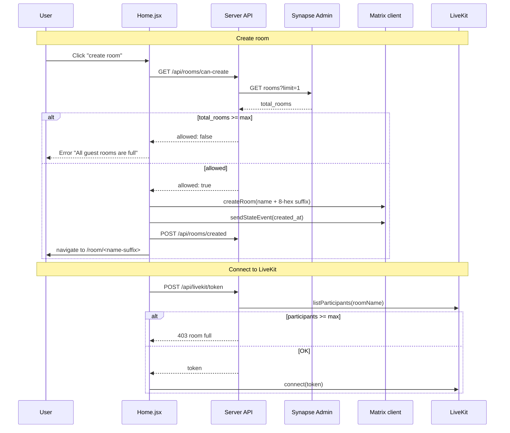
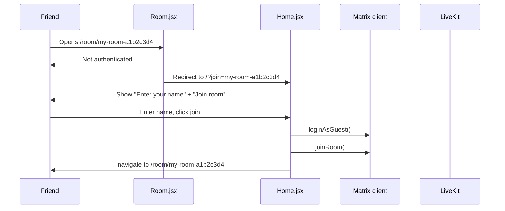
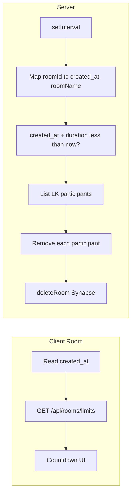

# Room lifecycle

How Hush creates Matrix/LiveKit rooms, what happens when participants leave, and how empty rooms are removed from the server.

---

## Creation

- **Matrix room:** Created by the client via Matrix Client-Server API (`createRoom`) when the user clicks "create room" on Home. Before creating, the client calls `GET /api/rooms/can-create`; if the server is at capacity (`total_rooms >= MAX_GUEST_ROOMS`), creation is blocked and the user sees "All guest rooms are full." The room alias always gets a random 8-hex suffix (e.g., `my-room-a1b2c3d4`) to prevent collisions and ensure unguessability; the link IS the invite (link-only access model). The display name stays as what the user typed. Options: name, alias, encryption, guest access, join rules (`public` for guest rooms). After creation, the client sends a state event `io.hush.room.created_at` with `{ created_at: ms }` and registers the room with `POST /api/rooms/created` for expiry tracking. Invite-only mode is deferred to persistent rooms/spaces (not guest rooms).
- **LiveKit room:** No explicit creation. The room is created implicitly when the first participant connects with a given `roomName` (used in the LiveKit token). The same name is used for both Matrix room (alias/name) and LiveKit room so that one Hush "room" is one Matrix room + one LiveKit room. The server enforces a maximum number of participants per room (`MAX_PARTICIPANTS_PER_ROOM`); when at capacity, `POST /api/livekit/token` returns 403 "This room is full."

---

## Guest room duration and expiry

Guest rooms have a maximum lifetime configured by `GUEST_ROOM_MAX_DURATION_MS` (default 3 hours). The client stores `created_at` in Matrix room state so all participants see a synchronized countdown. The server runs a periodic job (every 60 seconds) that:

1. For each room registered via `POST /api/rooms/created`, checks if `now - createdAt >= GUEST_ROOM_MAX_DURATION_MS`.
2. If expired: lists LiveKit participants in that room, removes each (disconnects them), deletes the Matrix room via Synapse Admin API, and removes the room from the tracking map.

Clients show a small countdown (bottom-right); when time reaches zero or the server disconnects them, they are redirected to Home.

| Endpoint | Purpose |
|----------|---------|
| `GET /api/rooms/limits` | Returns `{ guestRoomMaxDurationMs }` for client countdown (no other limits exposed). |
| `POST /api/rooms/created` | Body: `{ roomId, roomName, createdAt }`. Registers the room for expiry; called by the creator after sending the `io.hush.room.created_at` state event. |

---

## When a user leaves

1. **LiveKit:** The client calls `disconnectRoom()`: local tracks are stopped, mic pipeline cleaned up, `room.disconnect()` is called. The participant leaves the LiveKit room.
2. **Client cleanup:** Session storage is cleared (token, room name, matrix room id, etc.). If the user was a guest, logout is triggered. The app navigates to Home.

Room deletion is handled server-side by the orphan cleanup job (see below); the client does not attempt to delete the room on leave.

---

## Orphan room cleanup

The server runs a periodic job (every 5 seconds) that deletes rooms abandoned by all participants. A room is considered orphaned when it has had **0 active LiveKit participants for longer than 2 minutes** (grace period). The grace period prevents false positives during the link-join flow, where Matrix membership is created a few seconds before the LiveKit connection.

When the grace period expires the server calls `DELETE /_synapse/admin/v1/rooms/<room_id>` with `{ "purge": true }`, which force-kicks any remaining Matrix members and removes the room from the database in one call.

This handles all leave scenarios: clean leave via button, tab crash, network drop, or iOS Safari closing the page without firing JS cleanup.

---

## Configuration

### Room limits (server env)

- **`MAX_GUEST_ROOMS`** (default 30): Maximum number of guest rooms on the server. When at or above this, `GET /api/rooms/can-create` returns `allowed: false` and the client blocks room creation.
- **`GUEST_ROOM_MAX_DURATION_MS`** (default 10800000 = 3h): Maximum lifetime of a guest room in milliseconds. After this duration the server disconnects all participants and deletes the room.
- **`MAX_PARTICIPANTS_PER_ROOM`** (default 10): Maximum participants per room. When at capacity, `POST /api/livekit/token` returns 403.

### Required for deletion and limits

- **`SYNAPSE_ADMIN_TOKEN`** (server env): Access token of a Synapse **admin** user. Used for Admin API (room count for can-create, orphan cleanup, expiry delete). If unset, empty rooms are not deleted and room count is unavailable (can-create will deny).
- **`MATRIX_HOMESERVER_URL`** (server env): Base URL of the Synapse server (e.g. `http://localhost:8008` or `http://synapse:8008` in Docker). The server uses it for both whoami (token validation) and Admin API (`/_synapse/admin/...`).

### How to get a Synapse admin token (self-hosting)

The Hush server needs a Synapse **admin** access token to call the Admin API (room count for can-create, orphan cleanup, room expiry). Without it, room creation is blocked with "Room availability check unavailable" and empty rooms are not deleted.

**Prerequisites:** Synapse running (e.g. `docker-compose up -d`), and `registration_shared_secret` present in `synapse/data/homeserver.yaml`. The config generator (`./scripts/generate-synapse-config.sh`) and template include it; the value comes from `.env` as `SYNAPSE_REGISTRATION_SHARED_SECRET` (default `changeme`). If you generated config before that was added, add manually under "Registration and guests":

```yaml
registration_shared_secret: "changeme"
```

(Use the same value as in your `.env` or set a strong secret in both.)

**Step 1: Create an admin user**

From the project root, with Synapse running:

```bash
docker exec -it hush-synapse bash
register_new_matrix_user -c /data/homeserver.yaml -u admin -p YOUR_ADMIN_PASSWORD -a
exit
```

Replace `admin` / `YOUR_ADMIN_PASSWORD` with your chosen username and password. The `-a` flag makes the user an admin. If you see "No 'registration_shared_secret' defined", add it to `synapse/data/homeserver.yaml` as above and run `docker-compose restart synapse`, then retry.

**Step 2: Get the access token**

Log in as that user (from the host; use the URL where your Synapse client API is reachable, e.g. `http://localhost:80` if Caddy proxies to Synapse, or `http://localhost:8008` if you expose Synapse directly):

```bash
curl -s -X POST 'http://localhost:80/_matrix/client/v3/login' \
  -H 'Content-Type: application/json' \
  -d '{"type":"m.login.password","identifier":{"type":"m.id.user","user":"admin"},"password":"YOUR_ADMIN_PASSWORD"}'
```

Replace `admin` and `YOUR_ADMIN_PASSWORD`. In the JSON response, copy the value of `access_token` (long string).

**Step 3: Configure the Hush server**

1. In the project root `.env`, add or set:
   ```bash
   SYNAPSE_ADMIN_TOKEN=<paste the access_token here>
   ```

2. Ensure the Hush container receives it. In Docker Compose this is done via the `hush` service environment (see `docker-compose.yml`). After changing `.env`, restart:
   ```bash
   docker-compose up -d
   ```

Room limits (can-create, orphan cleanup, expiry) will then work. Optionally set `MAX_GUEST_ROOMS`, `GUEST_ROOM_MAX_DURATION_MS`, and `MAX_PARTICIPANTS_PER_ROOM` in `.env`; they are passed through to the Hush container with defaults (30, 3h, 10).

---

## Flow diagrams

### Create room



### Join via shared link (link-only model)



### Guest room countdown and expiry



---

## Summary

| Event | Matrix | LiveKit | Server |
|-------|--------|---------|--------|
| Create room | Client calls `createRoom()` with 8-hex suffix alias after `GET /api/rooms/can-create` | - | can-create uses Synapse room count; creator calls `POST /api/rooms/created` |
| Join via link | Client joins via `joinRoom(#name-suffix:server)` after `/?join=` redirect | Client gets token from `POST /api/livekit/token` | Token denied with 403 if room at `MAX_PARTICIPANTS_PER_ROOM` |
| User leaves | - | Client calls `room.disconnect()` | - |
| Room orphaned? | - | - | Orphan cleanup job: after 2-min grace with 0 LK participants, deletes room via Admin API |
| Room expired? | - | Server removes all participants | Periodic job: disconnect via LiveKit, delete room via Admin API |

Rooms are removed from Synapse when: (1) the orphan cleanup job detects the room has had no active LiveKit participants for 2 minutes (handles all leave/crash scenarios), or (2) the guest room duration has elapsed (expiry job).
